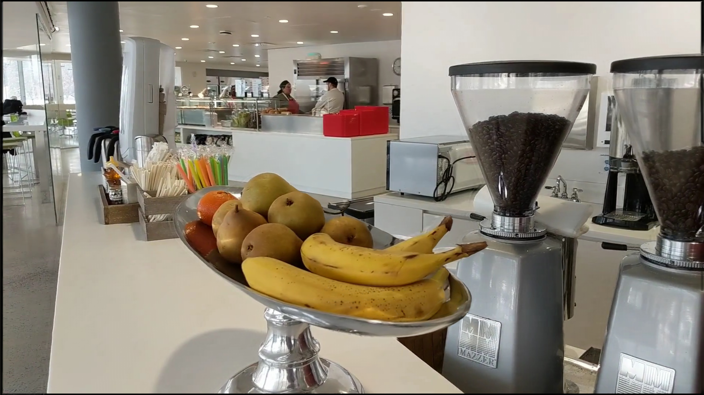
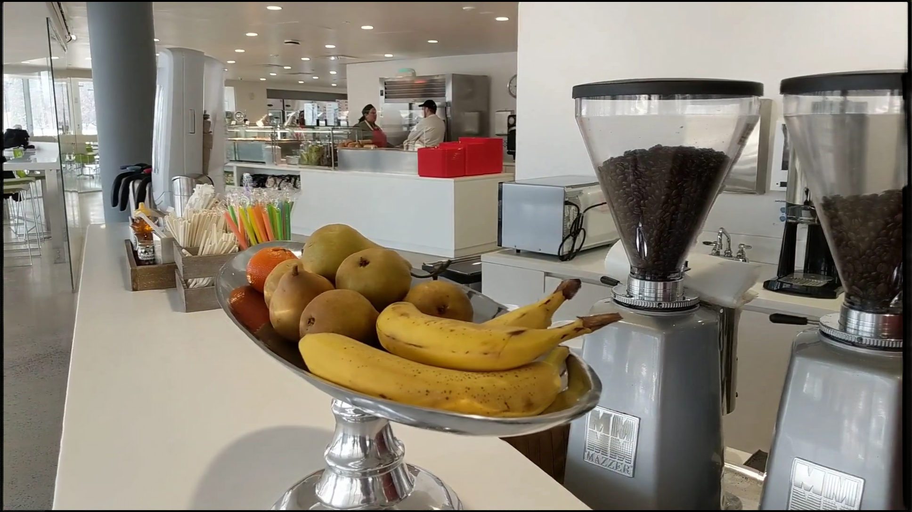

# Stereo Magnification: Learning view synthesis using multiplane images

This repository reproduces Pytorch implementation of ["Stereo Magnification: Learning View Synthesis using Multiplane Images"](https://tinghuiz.github.io/projects/mpi/)

The code is based on authors' Tensorflow implementation [here](https://github.com/google/stereo-magnification) and reproduce implementation [here](https://github.com/Findeton/mpi_vision). Thanks for sharing the codes.

example images with the original tensorflow weight, which I have converted to PyTorch state dicts.

<p align="center">
  
  
  
  
</p>

## Datasets
1. Download [real-estate-10k-dataset](https://google.github.io/realestate10k/).
2. Set your dataset path like this:
````
$/real-estate-10k
├──── Training_set
│      ├──── train
│      └──── test
````
3. Run **python downloadAndProcess.py** (youtube-dl needed).

### Train
Run the following command to train Stereo Magnification:

    python train.py
    
### Test
Run the following command to evaluate Stereo Magnification:

    python test.py

### Demo
Run the following command to make MPIs viewer:

    python demo.py
